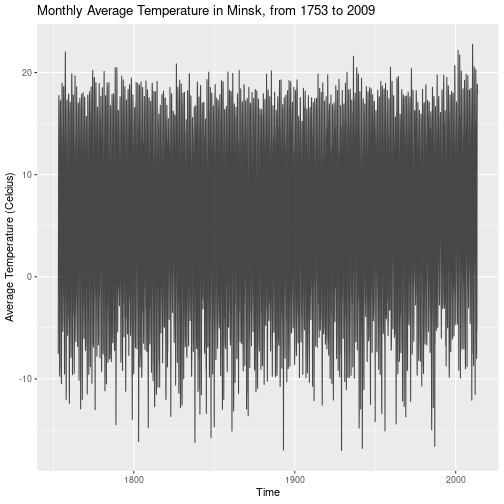
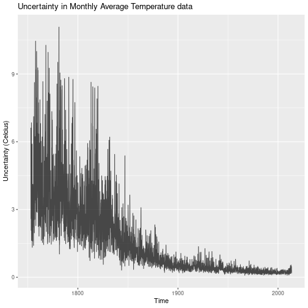
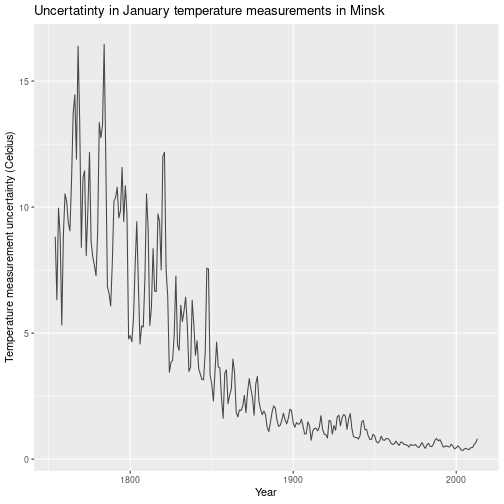
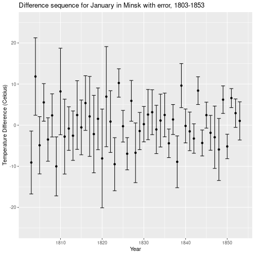
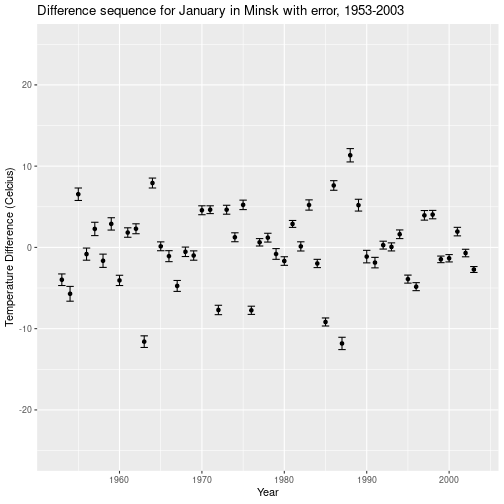

# Climate Change Analysis

## Set Preliminaries


```r
library(ggplot2)
data_loc="~/Projects/Data/Climate-Change-Analysis"
```

### Load in Data

(For data source, please see repository README) 


```r
city_data <- read.csv(paste(data_loc, "/GlobalLandTemperaturesByCity.csv", sep = ""))
city_data$dt <- as.Date(city_data$dt, "%Y-%m-%d")
head(city_data)
```

```
##           dt AverageTemperature AverageTemperatureUncertainty  City Country
## 1 1743-11-01              6.068                         1.737 Århus Denmark
## 2 1743-12-01                 NA                            NA Århus Denmark
## 3 1744-01-01                 NA                            NA Århus Denmark
## 4 1744-02-01                 NA                            NA Århus Denmark
## 5 1744-03-01                 NA                            NA Århus Denmark
## 6 1744-04-01              5.788                         3.624 Århus Denmark
##   Latitude Longitude
## 1   57.05N    10.33E
## 2   57.05N    10.33E
## 3   57.05N    10.33E
## 4   57.05N    10.33E
## 5   57.05N    10.33E
## 6   57.05N    10.33E
```

## EDA

There are records for several thousand cities here, each with regular monthly average temperature and uncertainty readings. It will be easier to focus on one city to begin with.


```r
minsk_data_init <- city_data[city_data[,"City"]=="Minsk",]
head(minsk_data_init)
```

```
##                 dt AverageTemperature AverageTemperatureUncertainty  City
## 4839603 1743-11-01              0.229                         1.878 Minsk
## 4839604 1743-12-01                 NA                            NA Minsk
## 4839605 1744-01-01                 NA                            NA Minsk
## 4839606 1744-02-01                 NA                            NA Minsk
## 4839607 1744-03-01                 NA                            NA Minsk
## 4839608 1744-04-01              7.358                         2.858 Minsk
##         Country Latitude Longitude
## 4839603 Belarus   53.84N    28.64E
## 4839604 Belarus   53.84N    28.64E
## 4839605 Belarus   53.84N    28.64E
## 4839606 Belarus   53.84N    28.64E
## 4839607 Belarus   53.84N    28.64E
## 4839608 Belarus   53.84N    28.64E
```

There are already visible data points with missing entries. If too much data is missing, this will affect the viability of the conclusions I can draw from the data, and will require steps to interpolate or remove missing data points. I therefore will check to see how many months in the sample contain a missing data point.


```r
minsk_data_missing = minsk_data_init[is.na(minsk_data_init[,"AverageTemperature"]) | is.na(minsk_data_init[,"AverageTemperatureUncertainty"]),]
dim(minsk_data_missing)
```

```
## [1] 73  7
```

Luckily, however, only 73 months in the record contain missing temperature data. This should be
a small enough proportion of the entries to continue our analysis without needing to
deal with data cleaning. It will also help to see how these missing months are distributed in the overall data:


```
## [1] "Missing Dates:"
```

```
##  [1] "1743-12-01" "1744-01-01" "1744-02-01" "1744-03-01" "1744-08-01"
##  [6] "1745-05-01" "1745-06-01" "1745-07-01" "1745-08-01" "1745-09-01"
## [11] "1745-10-01" "1745-11-01" "1745-12-01" "1746-01-01" "1746-02-01"
## [16] "1746-03-01" "1746-04-01" "1746-05-01" "1746-06-01" "1746-07-01"
## [21] "1746-08-01" "1746-09-01" "1746-10-01" "1746-11-01" "1746-12-01"
## [26] "1747-01-01" "1747-02-01" "1747-03-01" "1747-04-01" "1747-05-01"
## [31] "1747-06-01" "1747-07-01" "1747-08-01" "1747-09-01" "1747-10-01"
## [36] "1747-11-01" "1747-12-01" "1748-01-01" "1748-02-01" "1748-03-01"
## [41] "1748-04-01" "1748-05-01" "1748-06-01" "1748-07-01" "1748-08-01"
## [46] "1748-09-01" "1748-10-01" "1748-11-01" "1748-12-01" "1749-01-01"
## [51] "1749-02-01" "1749-03-01" "1749-04-01" "1749-05-01" "1749-06-01"
## [56] "1749-07-01" "1749-08-01" "1749-09-01" "1749-10-01" "1749-11-01"
## [61] "1749-12-01" "1750-11-01" "1751-05-01" "1751-10-01" "1751-11-01"
## [66] "1751-12-01" "1752-02-01" "1752-05-01" "1752-06-01" "1752-07-01"
## [71] "1752-08-01" "1752-09-01" "2013-09-01"
```
We can see here that the data is complete from around 1753 onwards, with the exception of one month in 2013. The easiest way around this is to remove all entries from before 1753, and ignore the single instance in 2013.


```r
minsk_data = minsk_data_init[format(minsk_data_init$dt, format="%Y")>=1753,]
minsk_data = minsk_data[!(is.na(minsk_data[,"AverageTemperature"]) | is.na(minsk_data[,"AverageTemperatureUncertainty"])),]
summary(minsk_data)
```

```
##        dt             AverageTemperature AverageTemperatureUncertainty
##  Min.   :1753-01-01   Min.   :-17.013    Min.   : 0.084               
##  1st Qu.:1818-02-22   1st Qu.: -2.722    1st Qu.: 0.332               
##  Median :1883-04-16   Median :  5.485    Median : 0.730               
##  Mean   :1883-04-16   Mean   :  5.417    Mean   : 1.505               
##  3rd Qu.:1948-06-08   3rd Qu.: 14.368    3rd Qu.: 2.242               
##  Max.   :2013-08-01   Max.   : 22.767    Max.   :11.078               
##                                                                       
##        City             Country        Latitude      Longitude   
##  Minsk   :3128   Belarus    :3128   53.84N :3128   28.64E :3128  
##  A Coruña:   0   Afghanistan:   0   0.80N  :   0   0.00W  :   0  
##  Aachen  :   0   Albania    :   0   0.80S  :   0   0.81E  :   0  
##  Aalborg :   0   Algeria    :   0   10.45N :   0   0.81W  :   0  
##  Aba     :   0   Angola     :   0   10.45S :   0   1.15E  :   0  
##  Abadan  :   0   Argentina  :   0   12.05N :   0   1.18E  :   0  
##  (Other) :   0   (Other)    :   0   (Other):   0   (Other):   0
```
<br />
<br />
We can create some plots to observe initial trends in the data


```r
plot(minsk_data[, c("dt","AverageTemperature")],type="l",main="Average Temperature in Minsk")
```



```r
plot(minsk_data[, c("dt","AverageTemperatureUncertainty")],type="l",main="Uncertainty of Average Temperature Reading in Minsk")
```


<br />
The average temperature reading data follows a regular variation, as would be
expected throughtout the year. An appropriate next step may be to isolate readings
for each month of the year or seasonally, in order to better see trends across time.

The uncertainty data tells us that early readings for temperature are wildly more
uncertain than those taken in the last century or so.


```r
seasonal_months <- c("Jan", "Apr", "Jul", "Oct")
minsk_data_snl <- list()
for (mon in seasonal_months){
    minsk_data_snl[[mon]] <- minsk_data[format(minsk_data$dt, format="%b") == mon,]
}
```
Plot seasonal data, which will make the data easier to model and test:


```r
seasonal_plot <- ggplot()
colours = c("#000080","#d40202","#d9d400", "#008000")
for (i in 1:4){
    seasonal_plot <- seasonal_plot + geom_line(data = minsk_data_snl[[i]], aes(x = dt, y = AverageTemperature), color = colours[i], alpha = 0.7)
}
seasonal_plot + theme_minimal()
```


<p>There are no visible trends in the data, as yearly variance causes interference.
However, it is possible we can statistically test for a significant increase over
time, which would indicate provable evidence of global warming.</p>


## Statistical Testing

<p>I will first try a basic test, asking if the yearly difference sequence has a mean greater than zero, which would certainly imply increase in temperature over time. I will be using a significance level of \alpha = 0.05. I will perform this test on each month in turn, thus obtaining 12 complete tests for each location.</p>

<p>Some alternative methods include the following:</p>

* Define a suitable year range (e.g. 1750-1900) as a "control" period, and testing if recent measurements fit within the control temperature distribution.
* Take only the yearly highest temperatures, and perform the difference sequence test.

### Difference Sequence Generation

First, obtain seperate data for each month and then convert the absolute data into yearly differences:


```r
months <- c("Jan", "Feb", "Mar", "Apr", "May", "Jun", "Jul", "Aug", "Sep", "Oct", "Nov", "Dec")
minsk_data_monthly <- list()
minsk_data_month_diff <- list()
for (mon in months){
  minsk_data_monthly[[mon]] <- minsk_data[format(minsk_data$dt, format="%b") == mon,]
}
head(minsk_data_monthly[["Jan"]])
```

```
##                 dt AverageTemperature AverageTemperatureUncertainty  City
## 4839713 1753-01-01             -7.544                         6.618 Minsk
## 4839725 1754-01-01             -7.887                         2.208 Minsk
## 4839737 1755-01-01             -9.892                         4.115 Minsk
## 4839749 1756-01-01             -4.501                         5.847 Minsk
## 4839761 1757-01-01             -9.528                         3.033 Minsk
## 4839773 1758-01-01            -12.011                         2.284 Minsk
##         Country Latitude Longitude
## 4839713 Belarus   53.84N    28.64E
## 4839725 Belarus   53.84N    28.64E
## 4839737 Belarus   53.84N    28.64E
## 4839749 Belarus   53.84N    28.64E
## 4839761 Belarus   53.84N    28.64E
## 4839773 Belarus   53.84N    28.64E
```


```r
for (mon in months){
  minsk_data_month_diff[[mon]] <- data.frame(minsk_data_monthly[[mon]]$dt[-1])
  names(minsk_data_month_diff[[mon]]) = c("Date")
  minsk_data_month_diff[[mon]]["Difference"] <- minsk_data_monthly[[mon]]$AverageTemperature[-1] - minsk_data_monthly[[mon]]$AverageTemperature[-(dim(minsk_data_monthly[[mon]])[1])]
  minsk_data_month_diff[[mon]]["DifferenceUncertainty"] <- minsk_data_monthly[[mon]]$AverageTemperatureUncertainty[-1] + minsk_data_monthly[[mon]]$AverageTemperatureUncertainty[-(dim(minsk_data_monthly[[mon]])[1])]
}
head(minsk_data_month_diff[["Jan"]])
```

```
##         Date Difference DifferenceUncertainty
## 1 1754-01-01     -0.343                 8.826
## 2 1755-01-01     -2.005                 6.323
## 3 1756-01-01      5.391                 9.962
## 4 1757-01-01     -5.027                 8.880
## 5 1758-01-01     -2.483                 5.317
## 6 1759-01-01      7.946                 8.934
```
We can visualise this transformation of the data:


```r
ggplot() + geom_point(data = minsk_data_month_diff[["Jan"]], aes(x = Date, y = Difference), alpha = 0.7) + ggtitle("Year-to-Year changes in January temperature in Minsk") + xlab("Year") + ylab("Temperature Difference (Celcius)")
```


```r
ggplot() + geom_line(data = minsk_data_month_diff[["Jan"]], aes(x = Date, y = DifferenceUncertainty), alpha = 0.7) + ggtitle("Uncertatinty in January temperature measurements in Minsk") + xlab("Year") + ylab("Temperature measurement uncertainty (Celcius)")
```



We need to bear uncertainty in mind, since the error in this data is quite significant. By taking the difference between two seperate measurements, we combine the error, which means the difference scores for earlier years will be particularly large, and this may cast doubt on any conclusions we are able to make. This is illustrated here by two sections of the January temperature difference series with uncertainty displayed, taken from early and late periods of recording respectively:


```r
ggplot(minsk_data_month_diff[["Jan"]][c(50:100),]) + geom_point(aes(x = Date, y = Difference))  + geom_errorbar(aes(x = Date, y = Difference, ymin=Difference-DifferenceUncertainty, ymax=Difference+DifferenceUncertainty)) +ggtitle("Difference sequence for January in Minsk with error, 1803-1853") + xlab("Year") + ylab("Temperature Difference (Celcius)") + ylim(-15,15)
```



```r
ggplot(minsk_data_month_diff[["Jan"]][c(200:250),]) + geom_point(aes(x = Date, y = Difference))  + geom_errorbar(aes(x = Date, y = Difference, ymin=Difference-DifferenceUncertainty, ymax=Difference+DifferenceUncertainty)) +ggtitle("Difference sequence for January in Minsk with error, 1953-2003") + xlab("Year") + ylab("Temperature Difference (Celcius)") + ylim(-15,15)
```



### Hypothesis Testing

Now that we have our transformed difference sequence (X_1_,X_2_,...,X_N_), I will divide by the empirical standard deviation and test the following hypothesis.

* $H_0_: X_1_,...,X_N_$ ~ i.i.d normal(0,1)
* $H_1_: X_1_,...,X_N_$ ~ i.i.d normal($\mu$,1)   where $\mu > 0$

We want our test statistic here to be the most powerful possible (smallest type II error rate), which by the Neyman-Pearson Lemma is equivelant the mean of the difference sequence. For a proof of this, please see Section A in the appendix. With my data split into months, I can gather 12 p-values per year of data.

Firstly to standardise the sequence:


```r
for (mon in months){
    minsk_data_month_diff[[mon]]["StandardisedDifference"] = minsk_data_month_diff[[mon]]$Difference / sd(minsk_data_month_diff[[mon]]$Difference)
}
head(minsk_data_month_diff[["Jan"]])
```

```
##         Date Difference DifferenceUncertainty StandardisedDifference
## 1 1754-01-01     -0.343                 8.826            -0.07011411
## 2 1755-01-01     -2.005                 6.323            -0.40985068
## 3 1756-01-01      5.391                 9.962             1.10199752
## 4 1757-01-01     -5.027                 8.880            -1.02759072
## 5 1758-01-01     -2.483                 5.317            -0.50756072
## 6 1759-01-01      7.946                 8.934             1.62427607
```
And to obtain p-values:

```r
p_values <- data.frame(Location=character(), JanPVal=integer(), FebPVal=integer(), MarPVal=integer(), AprPVal=integer(), MayPVal=integer(), JunPVal=integer(), JulPVal=integer(), AugPVal=integer(), SepPVal=integer(), OctPVal=integer(), NovPVal=integer(), DecPVal=integer(), stringsAsFactors = FALSE)
pval_calculator_minsk <- function(mon){
    diff_mean=mean(minsk_data_month_diff[[mon]]$StandardisedDifference)
    diff_data_length=dim(minsk_data_month_diff[[mon]])[1]
    return(1-pnorm(sqrt(diff_data_length)*diff_mean,0,1))
}
p_values[1,]=append(c("Minsk"),sapply(months,pval_calculator_minsk))
p_values
```

```
##   Location           JanPVal           FebPVal           MarPVal
## 1    Minsk 0.502407348664026 0.471094056580607 0.540317793905682
##             AprPVal           MayPVal           JunPVal           JulPVal
## 1 0.497918479594841 0.462519729600017 0.469820529738844 0.491110784084609
##             AugPVal           SepPVal          OctPVal           NovPVal
## 1 0.477493564579728 0.484464615006393 0.49605084205147 0.467720525267789
##             DecPVal
## 1 0.480465612671691
```
