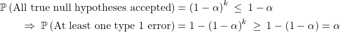

```{r, echo = FALSE}
library(knitr)
knitr::opts_chunk$set(fig.path = "Figures/EDA/EDA-")
```

# Climate Change Analysis

## Set Preliminaries

```{r}
library(ggplot2)
data_loc="~/Projects/Data/Climate-Change-Analysis"
```

### Load in Data

(For data source, please see repository README) 

```{r}
city_data <- read.csv(paste(data_loc, "/GlobalLandTemperaturesByCity.csv", sep = ""))
city_data$dt <- as.Date(city_data$dt, "%Y-%m-%d")
head(city_data)
```

## EDA

There are records for several thousand cities here, each with regular monthly average temperature and uncertainty readings. It will be easier to focus on one city to begin with.

```{r}
minsk_data_init <- city_data[city_data[,"City"]=="Minsk",]
head(minsk_data_init)
```

There are already visible data points with missing entries. If too much data is missing, this will affect the viability of the conclusions I can draw from the data, and will require steps to interpolate or remove missing data points. I therefore will check to see how many months in the sample contain a missing data point.

```{r}
minsk_data_missing = minsk_data_init[is.na(minsk_data_init[,"AverageTemperature"]) | is.na(minsk_data_init[,"AverageTemperatureUncertainty"]),]
dim(minsk_data_missing)
```

Luckily, however, only 73 months in the record contain missing temperature data. This should be
a small enough proportion of the entries to continue our analysis without needing to
deal with data cleaning. It will also help to see how these missing months are distributed in the overall data:

```{r, echo=FALSE}

print("Missing Dates:")
minsk_data_missing$dt
```
We can see here that the data is complete from around 1753 onwards, with the exception of one month in 2013. The easiest way around this is to remove all entries from before 1753, and ignore the single instance in 2013.

```{r}
minsk_data = minsk_data_init[format(minsk_data_init$dt, format="%Y")>=1753,]
minsk_data = minsk_data[!(is.na(minsk_data[,"AverageTemperature"]) | is.na(minsk_data[,"AverageTemperatureUncertainty"])),]
summary(minsk_data)
```
<br />
<br />
We can create some plots to observe initial trends in the data

```{r}
ggplot() + geom_line(data = minsk_data, aes(x= dt, y = AverageTemperature), alpha=0.7) + ggtitle("Monthly Average Temperature in Minsk, from 1753 to 2009") + xlab("Time") + ylab("Average Temperature (Celcius)")
ggplot() + geom_line(data = minsk_data, aes(x= dt, y = AverageTemperatureUncertainty), alpha=0.7) + ggtitle("Uncertainty in Monthly Average Temperature data") + xlab("Time") + ylab("Uncertainty (Celcius)")
```
<br />
The average temperature reading data follows a regular variation, as would be
expected throughtout the year. An appropriate next step may be to isolate readings
for each month of the year or seasonally, in order to better see trends across time.

The uncertainty data tells us that early readings for temperature are wildly more
uncertain than those taken in the last century or so.

```{r}
seasonal_months <- c("Jan", "Apr", "Jul", "Oct")
minsk_data_snl <- list()
for (mon in seasonal_months){
    minsk_data_snl[[mon]] <- minsk_data[format(minsk_data$dt, format="%b") == mon,]
}
```
Plot seasonal data, which will make the data easier to model and test:

```{r}
seasonal_plot <- ggplot()
colours = c("#000080","#d40202","#d9d400", "#008000")
for (i in 1:4){
    seasonal_plot <- seasonal_plot + geom_line(data = minsk_data_snl[[i]], aes(x = dt, y = AverageTemperature), color = colours[i], alpha = 0.7)
}
seasonal_plot + theme_minimal()
```

<p>There are no visible trends in the data, as yearly variance causes interference.
However, it is possible we can statistically test for a significant increase over
time, which would indicate provable evidence of global warming.</p>


## Statistical Testing

<p>My first test will be the most basic, asking if the yearly difference sequence has a mean greater than zero (which would certainly imply increase in temperature over time). I will perform this test on each month in turn, thus obtaining 12 complete tests for each location. This will also mean I need to be careful in my choice of significance level (&alpha;) if I want to contain the Family Wise Error Rate at 5% (more on this later).</p>

<p>My initial ideas for alternative testing methods include the following:</p>

* Define a suitable year range (e.g. 1750-1900) as a "control" period, and testing if recent measurements fit within the control temperature distribution.
* Take only the yearly highest temperatures, and perform the difference sequence test as before.

### Difference Sequence Generation

For our first test, we want to split our data by month, and then convert the absolute temperature data into yearly differences:

```{r}
months <- c("Jan", "Feb", "Mar", "Apr", "May", "Jun", "Jul", "Aug", "Sep", "Oct", "Nov", "Dec")
minsk_data_monthly <- list()
minsk_data_month_diff <- list()
for (mon in months){
  minsk_data_monthly[[mon]] <- minsk_data[format(minsk_data$dt, format="%b") == mon,]
}
head(minsk_data_monthly[["Jan"]])
```

```{r}
for (mon in months){
  minsk_data_month_diff[[mon]] <- data.frame(minsk_data_monthly[[mon]]$dt[-1])
  names(minsk_data_month_diff[[mon]]) = c("Date")
  minsk_data_month_diff[[mon]]["Difference"] <- minsk_data_monthly[[mon]]$AverageTemperature[-1] - minsk_data_monthly[[mon]]$AverageTemperature[-(dim(minsk_data_monthly[[mon]])[1])]
  minsk_data_month_diff[[mon]]["DifferenceUncertainty"] <- minsk_data_monthly[[mon]]$AverageTemperatureUncertainty[-1] + minsk_data_monthly[[mon]]$AverageTemperatureUncertainty[-(dim(minsk_data_monthly[[mon]])[1])]
}
head(minsk_data_month_diff[["Jan"]])
```
We can visualise this transformation of the data:

```{r}
ggplot() + geom_point(data = minsk_data_month_diff[["Jan"]], aes(x = Date, y = Difference), alpha = 0.7) + ggtitle("Year-to-Year changes in January temperature in Minsk") + xlab("Year") + ylab("Temperature Difference (Celcius)")
ggplot() + geom_line(data = minsk_data_month_diff[["Jan"]], aes(x = Date, y = DifferenceUncertainty), alpha = 0.7) + ggtitle("Uncertatinty in January temperature measurements in Minsk") + xlab("Year") + ylab("Temperature measurement uncertainty (Celcius)")
```

We need to bear uncertainty in mind, since the error in this data is quite significant. By taking the difference between two seperate measurements, we combine the error, which means the difference scores for earlier years will be particularly large, and this may cast doubt on any conclusions we are able to make. This is illustrated here by two sections of the January temperature difference series with uncertainty displayed, taken from early and late periods of recording respectively:

```{r}
ggplot(minsk_data_month_diff[["Jan"]][c(50:100),]) + geom_point(aes(x = Date, y = Difference))  + geom_errorbar(aes(x = Date, y = Difference, ymin=Difference-DifferenceUncertainty, ymax=Difference+DifferenceUncertainty)) +ggtitle("Difference sequence for January in Minsk with error, 1803-1853") + xlab("Year") + ylab("Temperature Difference (Celcius)") + ylim(-25,25)
ggplot(minsk_data_month_diff[["Jan"]][c(200:250),]) + geom_point(aes(x = Date, y = Difference))  + geom_errorbar(aes(x = Date, y = Difference, ymin=Difference-DifferenceUncertainty, ymax=Difference+DifferenceUncertainty)) +ggtitle("Difference sequence for January in Minsk with error, 1953-2003") + xlab("Year") + ylab("Temperature Difference (Celcius)") + ylim(-25,25)
```

As we can now see, the later difference values yield greatly reduced error bounds.


### Hypothesis Testing

Now that we have our transformed difference sequences (X<sub>1</sub>,X<sub>2</sub>,...,X<sub>N</sub>) for each month, I will divide by the empirical standard deviation and test the following hypothesis:

* H<sub>0</sub>: X<sub>1</sub>,...,X<sub>N</sub> ~ i.i.d normal(0,1)
* H<sub>1</sub>: X<sub>1</sub>,...,X<sub>N</sub> ~ i.i.d normal(&mu;,1)   where &mu; > 0

Our null hypothesis is that the temperature has remained constant, and the alternative is that there has been an overall (but unspecified) increase in temperature. This is a one-tailed test, as our aim is to detect a positive increase in temperature change.

We want our test statistic here to be the most powerful possible (smallest type II error rate), which by the Neyman-Pearson Lemma is equivelant the mean of the difference sequence. For a proof of this, please see Section A of the Appendix. With my data split into months, I can gather 12 p-values per year of data.

Firstly to standardise the sequence:

```{r}
for (mon in months){
    minsk_data_month_diff[[mon]]["StandardisedDifference"] = minsk_data_month_diff[[mon]]$Difference / sd(minsk_data_month_diff[[mon]]$Difference)
}
head(minsk_data_month_diff[["Jan"]])
```
And to obtain p-values:

```{r}
p_values <- data.frame(Location=character(), JanPVal=integer(), FebPVal=integer(), MarPVal=integer(), AprPVal=integer(), MayPVal=integer(), JunPVal=integer(), JulPVal=integer(), AugPVal=integer(), SepPVal=integer(), OctPVal=integer(), NovPVal=integer(), DecPVal=integer(), stringsAsFactors = FALSE)
pval_calculator_minsk <- function(mon){
    diff_mean=mean(minsk_data_month_diff[[mon]]$StandardisedDifference)
    diff_data_length=dim(minsk_data_month_diff[[mon]])[1]
    return(1-pnorm(sqrt(diff_data_length)*diff_mean,0,1))
}
p_values[1,]=append(c("Minsk"),sapply(months,pval_calculator_minsk))
p_values
```
These p-values are large, well above any significance threshold we are likely to set. However, we have a good opportunity to discuss &alpha;-correction:

For a single hypothesis test, the significance level &alpha; is normally chosen to be 0.05. This results in the type 1 error rate (the probability of a rejecting a true null hypothesis) being kept at 5%.

However, with multiple tests, the probabilities are compounded. For example, if our analysis comprised of 20 hypotheses, we can always expect to reject one true null when using a significance level of &alpha;=0.05. We must be focussed on controlling the Family Wise Error Rate (the probability of rejecting at least one true null hypothesis). We can calculate how this value changes under any given individual significance level &alpha;, when we have &N; total hypotheses:


Assuming &k; out of &N; null hypotheses are true (where &k;&ge;1):



And hence the FWER &ge; &alpha; for any given significance level. Therefore, choosing the standard level &alpha;=0.05 actually results in a greater collective error rate, so we must select &alpha; more conservatively in order to keep the Family Wise Error Rate at 5%.

The simplest method of controlling the FWER is the Bonferroni Correction at a level of &beta;, which means choosing a general significance level &alpha;=&beta;/&N; where &N; is the number of seperate tests, which in our case (&N;=12) means &alpha;&asymp;0.0042.
